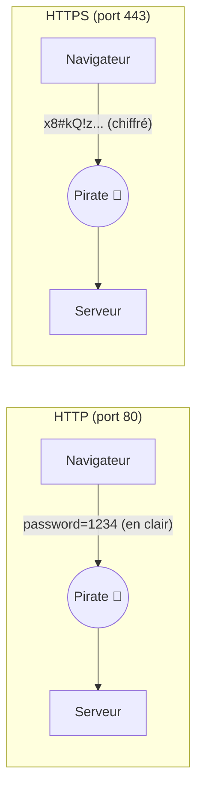
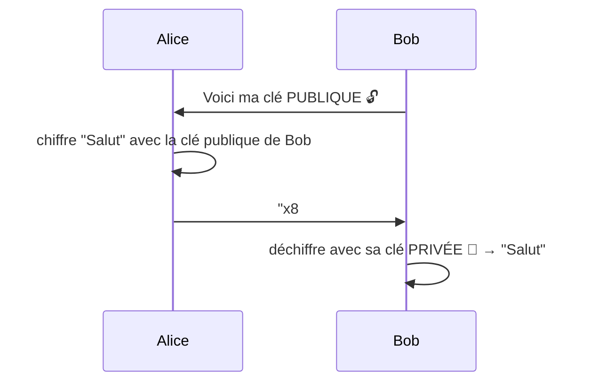
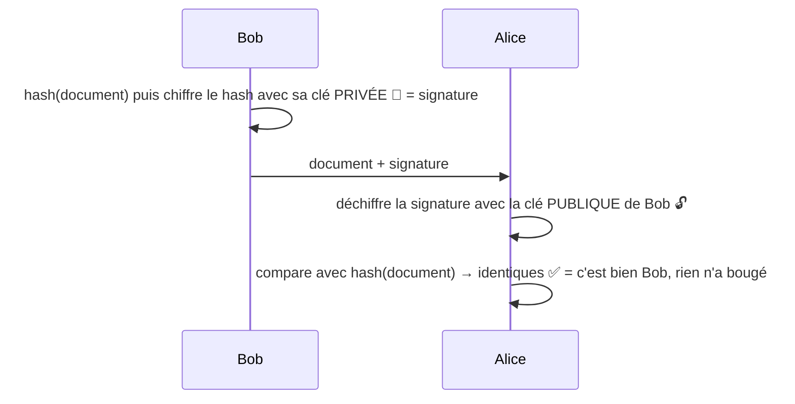
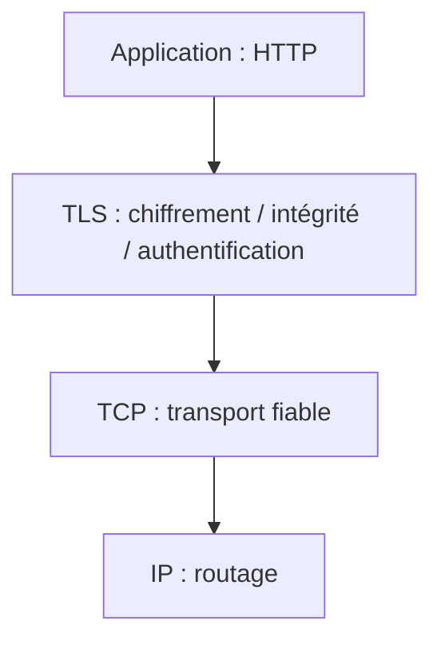
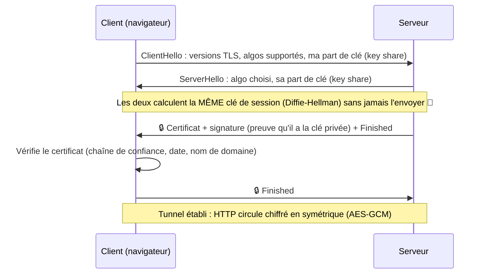
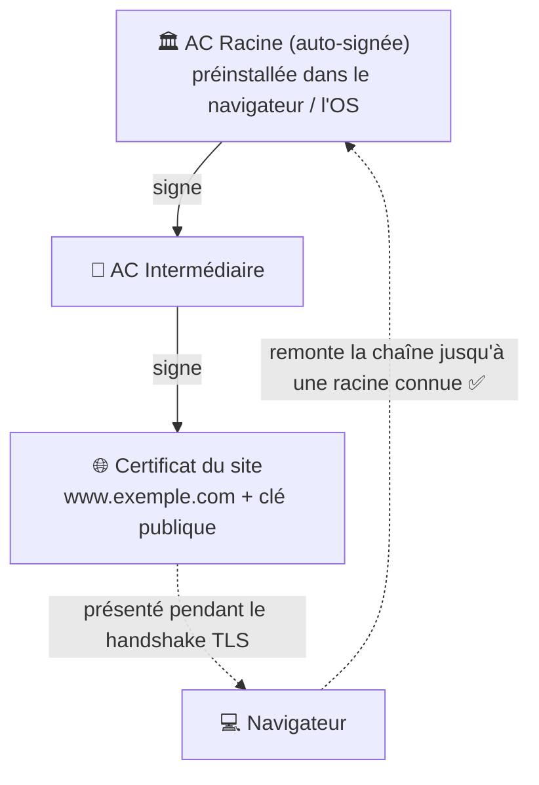
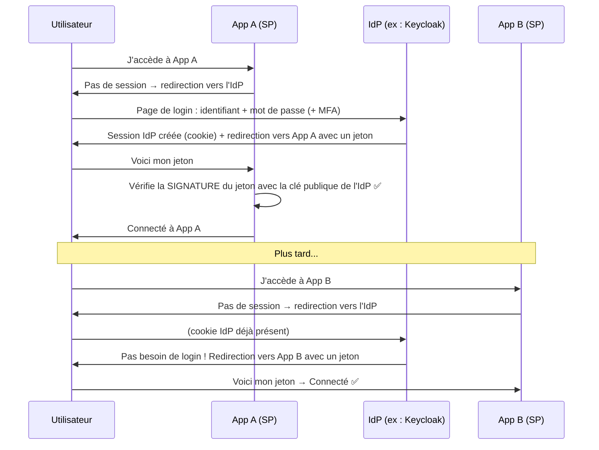

Cette note regroupe les concepts à connaître pour comprendre **comment deux machines échangent de façon sécurisée sur Internet** (HTTPS, TLS, clés publique/privée, certificats, PKI) et **comment un utilisateur s'authentifie une seule fois pour plusieurs applis** (SSO).

Les notions s'enchaînent dans cet ordre :
1. HTTP / HTTPS → le protocole web, en clair ou chiffré
2. Chiffrement symétrique / asymétrique → les deux briques de base de la crypto
3. SSL / TLS → le protocole qui utilise ces briques pour sécuriser HTTP
4. Certificats & PKI → comment on sait qu'une clé publique appartient bien au bon serveur
5. SSO → s'authentifier une seule fois pour toutes les applis

---
## **HTTP vs HTTPS**
**HTTP** (HyperText Transfer Protocol) est le protocole utilisé par le navigateur pour discuter avec un serveur web : le client envoie une **requête** (`GET /page`), le serveur renvoie une **réponse** (code `200`, HTML, JSON…). Voir aussi [[Protocole d'API]].

Le problème : en HTTP, tout circule **en clair**. N'importe qui sur le chemin (wifi public, box, FAI, routeur) peut :
- **lire** les données (mots de passe, cookies de session…) → atteinte à la **confidentialité**
- **modifier** les données (injecter du JS dans la page) → atteinte à l'**intégrité**
- **se faire passer** pour le serveur → atteinte à l'**authenticité**

C'est l'attaque **Man-in-the-Middle (MITM)**.

**HTTPS** = **HTTP + TLS**. C'est exactement le même HTTP, mais transporté dans un **tunnel chiffré** par TLS. Il apporte les 3 garanties :

| Garantie | Question | Ce qui la fournit |
|---|---|---|
| **Confidentialité** | Personne d'autre ne peut lire ? | Chiffrement symétrique (AES, ChaCha20) |
| **Intégrité** | Personne n'a modifié le message ? | MAC / AEAD (le message est "scellé") |
| **Authenticité** | Je parle bien au vrai serveur ? | Certificat signé par une autorité (PKI) |



À retenir :
- HTTP → port **80**, HTTPS → port **443**
- Le 🔒 dans le navigateur = la connexion est chiffrée **et** le certificat est valide. Ça ne veut **pas** dire que le site est honnête (un site de phishing peut avoir un certificat valide).
- **HSTS** (`Strict-Transport-Security`) : header qui dit au navigateur "à partir de maintenant, viens toujours en HTTPS chez moi", ce qui empêche un attaquant de forcer une version HTTP.
- Ce qui reste visible malgré HTTPS : l'IP du serveur et le nom de domaine (via le DNS et le champ **SNI**). L'URL complète, les headers, les cookies et le body sont chiffrés.

---
## **Clé publique / clé privée : comment ça marche**
Il existe deux grandes familles de chiffrement.

### Chiffrement **symétrique**
**Une seule clé** sert à chiffrer ET à déchiffrer. Ex : **AES**, ChaCha20.
- ✅ Très **rapide**, parfait pour chiffrer beaucoup de données
- ❌ Problème de **l'échange de la clé** : comment envoyer la clé à l'autre sans qu'elle soit interceptée ? Si je l'envoie en clair, le pirate l'a aussi.

### Chiffrement **asymétrique** (clé publique / clé privée)
Chaque personne possède **une paire de clés** liées mathématiquement :
- la **clé publique** → on la donne à tout le monde
- la **clé privée** → on la garde secrète, **elle ne sort jamais** de la machine

Ce qui est chiffré avec l'une ne peut être déchiffré **qu'avec l'autre**. Ex : **RSA**, **ECC** (courbes elliptiques, ECDSA / Ed25519).

**Analogie du cadenas** 🔓 : la clé publique, c'est un cadenas ouvert que je distribue à tout le monde. N'importe qui peut mettre un message dans une boîte et la fermer avec mon cadenas. Mais **seul moi**, avec ma clé privée, peux l'ouvrir.

Il y a deux usages, à ne pas confondre :

**1. Chiffrer (confidentialité)** → on chiffre avec la **clé publique du destinataire**, seul lui peut déchiffrer avec sa clé privée.


**2. Signer (authenticité + intégrité)** → on signe avec **sa propre clé privée**, tout le monde peut vérifier avec la clé publique. Si la vérification marche, c'est que c'est bien moi qui ai signé (je suis le seul à avoir la clé privée) et que le document n'a pas été modifié.

C'est le principe de la **signature électronique** (très utilisé chez Atexo pour les marchés publics : signature des offres, vérification avec DSS).

**Moyen mnémotechnique** :
- Chiffrer → avec la clé **publique de l'autre**
- Signer → avec **ma clé privée**

### Pourquoi on combine les deux ?
L'asymétrique est **lent** (environ 1000x plus que le symétrique), le symétrique a le **problème d'échange de clé**. Donc on fait un **chiffrement hybride** :
1. On utilise l'asymétrique **au début**, juste pour se mettre d'accord sur une clé secrète commune (et vérifier l'identité du serveur)
2. Ensuite, tout l'échange est chiffré en **symétrique** avec cette clé (la **clé de session**)

C'est exactement ce que fait TLS 👇

**Hash ≠ chiffrement** : un **hash** (SHA-256) transforme une donnée en empreinte de taille fixe, **à sens unique** (on ne peut pas revenir en arrière). Sert à vérifier l'intégrité ou stocker des mots de passe (avec bcrypt/argon2). Un chiffrement, lui, est **réversible** avec la clé.

---
## **SSL / TLS**
**SSL** (Secure Sockets Layer) est l'ancêtre, **TLS** (Transport Layer Security) est son successeur. On dit encore souvent "SSL" ou "certificat SSL" par habitude, mais en pratique on utilise toujours du TLS.

TLS se place **entre TCP et HTTP** : l'appli parle HTTP normalement, TLS chiffre tout avant de l'envoyer sur le réseau. Ce n'est pas propre au web : TLS sécurise aussi les mails (SMTPS, IMAPS), les connexions BDD (PostgreSQL avec `sslmode`), LDAPS, etc.



### Le **handshake TLS** (la poignée de main)
Avant d'envoyer la moindre donnée HTTP, le client et le serveur font un handshake pour : choisir les algos, vérifier l'identité du serveur, et générer la clé de session.

Version **TLS 1.3** (1 seul aller-retour) :


Les étapes en clair :
1. **ClientHello** : le client dit "je parle TLS 1.3, je connais ces algos, et voilà ma moitié de clé".
2. **ServerHello** : le serveur choisit les algos et envoie sa moitié de clé.
3. **Diffie-Hellman (ECDHE)** : grâce aux maths, chacun combine sa partie secrète avec la partie publique de l'autre et ils obtiennent **la même clé**, sans qu'elle ait circulé. Un pirate qui voit passer les deux moitiés publiques ne peut pas la recalculer.
4. **Certificat** : le serveur prouve son identité en envoyant son certificat et en **signant** l'échange avec sa clé privée. Le client vérifie le certificat avec la PKI (voir plus bas).
5. **Finished** : les deux confirment que personne n'a trafiqué le handshake. Ensuite tout est chiffré en **symétrique**.

**Différence avec TLS 1.2 (l'explication "classique")** : avec l'échange de clé RSA, le client générait un secret, le **chiffrait avec la clé publique du serveur** (trouvée dans le certificat), et seul le serveur pouvait le déchiffrer avec sa clé privée. Problème : si la clé privée du serveur fuit un jour, un pirate qui a enregistré les anciens échanges peut **tout** déchiffrer. TLS 1.3 impose Diffie-Hellman éphémère → **Forward Secrecy** (confidentialité persistante) : chaque session a sa propre clé jetable, une fuite future ne compromet pas le passé.

### **mTLS** (mutual TLS)
En TLS classique, **seul le serveur** présente un certificat. En **mTLS**, le **client aussi** présente un certificat → les deux s'authentifient. Très utilisé pour la communication **entre services / API partenaires** (machine à machine), ou l'authentification par carte à puce/certificat client.

---
## **Certificats & PKI**
Le chiffrement asymétrique a une faille : quand le serveur m'envoie sa clé publique, **comment je sais que c'est vraiment celle de `impots.gouv.fr`** et pas celle d'un pirate au milieu ? → Il faut un **tiers de confiance** qui atteste "cette clé publique appartient bien à ce domaine". C'est le rôle du **certificat** et de la **PKI**.

### Le **certificat** (X.509)
C'est une "carte d'identité numérique" qui contient :
- le **sujet** (le nom de domaine `*.atexo.com`, ou une personne pour un certificat de signature)
- la **clé publique** du sujet
- l'**émetteur** (l'autorité qui l'a délivré)
- les **dates de validité**
- la **signature de l'autorité** qui garantit tout le reste

Le certificat est public, la clé privée associée reste sur le serveur.

### La **PKI** (Public Key Infrastructure / IGC en français)
C'est **tout l'écosystème** qui permet de faire confiance aux clés publiques : les autorités, les règles, les certificats, les listes de révocation…

Les acteurs :
- **CA (Certificate Authority / AC)** : l'autorité qui signe les certificats (Let's Encrypt, DigiCert, Certinomis, ChamberSign…)
- **Root CA (AC racine)** : l'autorité tout en haut, son certificat est **auto-signé** et **préinstallé** dans ton OS / navigateur / JVM (le "trust store", ex. `cacerts` en Java)
- **CA intermédiaire** : signée par la racine, c'est elle qui signe les certificats des sites (la racine reste au coffre, hors ligne, pour limiter les risques)
- **RA (Registration Authority)** : vérifie l'identité du demandeur avant émission

### La **chaîne de confiance**

Le navigateur vérifie : la signature de chaque maillon, que le nom de domaine correspond, que le certificat n'est pas expiré, et qu'il n'est **pas révoqué**.

### Révocation : **CRL & OCSP**
Si une clé privée est volée, il faut pouvoir "annuler" le certificat avant sa date d'expiration :
- **CRL** (Certificate Revocation List) : liste publiée par la CA de tous les certificats révoqués, qu'on télécharge (peut être grosse et pas à jour)
- **OCSP** (Online Certificate Status Protocol) : on interroge la CA en temps réel "ce certificat est-il encore valide ?"

⚠️ En prod, si le serveur n'arrive pas à joindre les CRL/OCSP (proxy, firewall, CA lente), la validation d'une signature électronique peut **bloquer ou ralentir** l'appli → c'est un cas classique d'incident sur les plateformes de dématérialisation.

### Commandes utiles
```bash
# Voir le certificat d'un site et sa chaîne
openssl s_client -connect www.exemple.com:443 -showcerts

# Lire le contenu d'un certificat
openssl x509 -in cert.pem -text -noout

# Générer une paire de clés + une demande de certificat (CSR) à envoyer à une CA
openssl req -new -newkey rsa:2048 -nodes -keyout serveur.key -out serveur.csr
```
Formats courants : `.pem`/`.crt` (texte base64), `.der` (binaire), `.p12`/`.pfx` (certificat **+ clé privée**, protégé par mot de passe), `.jks` (keystore Java).

### ⚠️ **PKI ≠ KPI**
- **PKI** = *Public Key Infrastructure*, l'infrastructure de certificats décrite ci-dessus.
- **KPI** = *Key Performance Indicator*, un **indicateur de performance** (taux de disponibilité, temps de réponse moyen, vélocité d'un sprint…). Rien à voir avec la crypto, c'est du pilotage/monitoring (voir [[Grafana]]).

---
## **SSO (Single Sign-On)**
Le **SSO** permet de **se connecter une seule fois** et d'accéder ensuite à **plusieurs applications** sans ressaisir son mot de passe. Ex : un compte Google pour Gmail, Drive, YouTube ; le compte d'entreprise pour Jira, GitLab, Slack.

- ✅ Côté utilisateur : un seul mot de passe, moins de friction
- ✅ Côté sécurité : les applis **ne voient jamais le mot de passe**, l'authentification (et la MFA) est centralisée à un seul endroit, on désactive un compte à un seul endroit quand quelqu'un part
- ❌ Point unique de défaillance : si le fournisseur d'identité tombe, plus personne ne se connecte nulle part. Et si le compte est compromis, l'attaquant accède à tout → MFA indispensable

### Les acteurs
- **IdP (Identity Provider)** : le serveur qui **authentifie** l'utilisateur et qui fait foi (Keycloak, Azure AD / Entra ID, Okta, Google, FranceConnect…). KeyCloack possède des realms, ce sont des espace isolé avec leurs propres utilisateurs, applications et ses propres règles de connexion. Le SSO ne fonctionne qu'à l'intérieur d'un même realm. Un jeton émis par un realm n'est pas accepté par un autre realm. On crée un realm par client ou organisation, par exemple par conseil régionnaux, qui doivent pas partager les mêmes id.
- **SP (Service Provider)** / **Client** : l'application qui **délègue** l'authentification à l'IdP (Jira, ton appli Symfony, ton appli Spring…)

### Comment ça marche



### Les protocoles
| Protocole | Format du jeton | Usage typique |
|---|---|---|
| **SAML 2.0** | Assertion **XML** signée | SSO d'entreprise "historique", administrations, applis legacy |
| **OAuth 2.0** | Access token | ⚠️ Protocole d'**autorisation** ("l'appli X peut accéder à mes données chez Y"), pas d'authentification à la base |
| **OpenID Connect (OIDC)** | **JWT** (`id_token`) | Couche d'**authentification** au-dessus d'OAuth 2.0, le standard moderne (web, mobile, API) |
| **CAS** | Ticket | Très utilisé dans les universités |
| **Kerberos** | Ticket | Réseau Windows / Active Directory |

**Authentification vs autorisation** :
- **Authentification (AuthN)** = *qui es-tu ?* → prouver son identité (login)
- **Autorisation (AuthZ)** = *qu'as-tu le droit de faire ?* → les rôles, les permissions

Un **JWT** (JSON Web Token) ressemble à `xxxxx.yyyyy.zzzzz` : `header.payload.signature`, encodés en base64. Le payload (qui est l'utilisateur, ses rôles, l'expiration) est **lisible par tout le monde** (base64 ≠ chiffrement !), mais **infalsifiable** grâce à la signature. Donc jamais de données sensibles dedans.

**SSO ≠ gestionnaire de mots de passe** : un gestionnaire (Passbolt, Bitwarden) retient plein de mots de passe différents et les remplit à ta place. Le SSO, lui, supprime les mots de passe par appli : il n'y en a qu'un, chez l'IdP.

---
## **Récap en une phrase par concept**
- **HTTPS** = HTTP transporté dans un tunnel TLS → confidentialité, intégrité, authenticité.
- **Symétrique** = une clé, rapide ; **asymétrique** = paire publique/privée, lent mais résout l'échange de clé et permet la signature.
- **Chiffrer** avec la clé publique de l'autre, **signer** avec sa propre clé privée.
- **TLS** = handshake asymétrique (Diffie-Hellman + certificat) puis échange symétrique ; TLS 1.3 recommandé, SSL mort.
- **Certificat** = clé publique + identité, signés par une CA ; **PKI** = tout le système de confiance (racines, intermédiaires, révocation CRL/OCSP).
- **SSO** = un login chez l'IdP, des jetons signés pour toutes les applis (SAML, OIDC).
